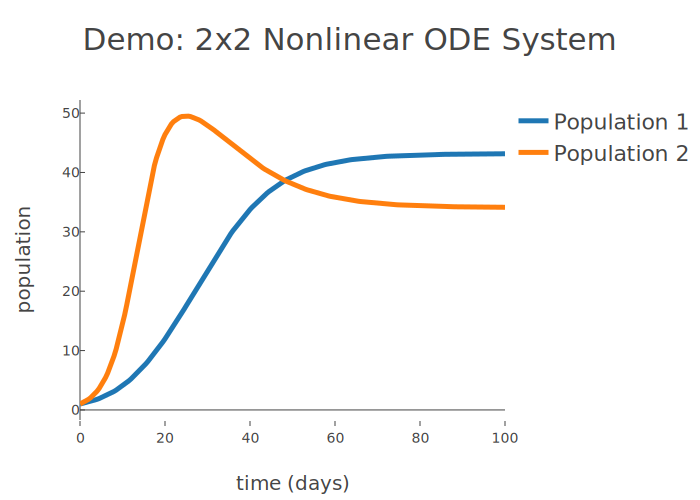

# QBioPlots #

A collection of classes that solve common quantitative biology problems.

### Required Packages ###
* numpy
* [plotly](https://plot.ly/) 
* scipy

All of the classes generate online figures, which requires [initialization](https://plot.ly/python/getting-started/). A find and replace can be used to switch to offline figures: py.plot -> py.offline.plot

## PlotODETwoByTwo - 2x2 ODE System

This class can be used to solve and plot a 2x2 system of IVP ODEs. An example can be viewed with:

```
from QBioPlots import PlotODETwoByTwo as ode22

ode22.demo()
```

The example solves a competition model with the following parameters:

### Model ###


### Parameters ###
```
r_1 = 0.15      r_2 = 0.3
k_1 = 50        k_2 = 60
a = 0.2         b = 0.6
```
### Output ###


### Usage ###

To solve a 2x2 system, the following parameters are necessary
```
steps   - Number of intervals over your domain
x_start - First value of your domain
x_end   - Last value of your domain
figure_title - (string) Title for the plot
x_label      - (string) Label for the x-axis
y_label      - (string) Label for the y-axis
x1_label     - (string) Label for the first dependent variable
x2_label     - (string) Label for the second dependent variable
eqn1 - (lambda) First equation of the system
eqn2 - (lambda) Second equation of the system
init_conds - (list) List containing the initial values for x1 and x2
```

Example:
```
from QBioPlots import PlotODETwoByTwo as ode22

# Solution Parameters
steps = 200
x_start = 0
x_end = 100

# y_1
r_1 = 0.15
k_1 = 50
a = 0.2

# y_2 
r_2 = 0.3
k_2 = 60
b = 0.6

# Plot Labels
figure_title = "2x2 Nonlinear ODE System"
x_label = "time (days)"
y_label = "population"
x1_label = "Population 1"
x2_label = "Population 2"

# Equations
eqn1 = lambda x1,x2: r_1*x1 * (k_1 - x1 - a*x2) / k_1
eqn2 = lambda x1,x2: r_2*x2 * (k_2 - b*x1 - x2) / k_2

# Initial Conditions
init_conds = [1,1]

ode22(steps, x_start, x_end, figure_title, x_label, y_label, x1_label, x2_label, eqn1, eqn2, init_conds)
```
